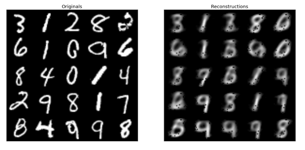
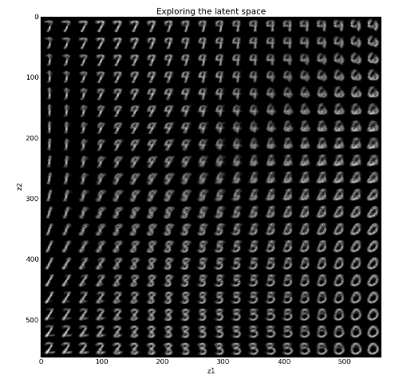

# vae
My attempt at variational autoencoder with Theano and Lasagne.

    python run.py

Not really an original implementation; I used code snippets from [parmesan](https://github.com/casperkaae/parmesan) library, and also latent space visualization function from [DTU-deeplearning](https://github.com/DTU-deeplearning). The idea was to make an implementation as simple as possible just to understand how it works at all, not feature-rich model.

Kingma, Diederik P., and Max Welling. "[Auto-encoding variational bayes.](http://arxiv.org/abs/1312.6114)" arXiv preprint arXiv:1312.6114 (2013).